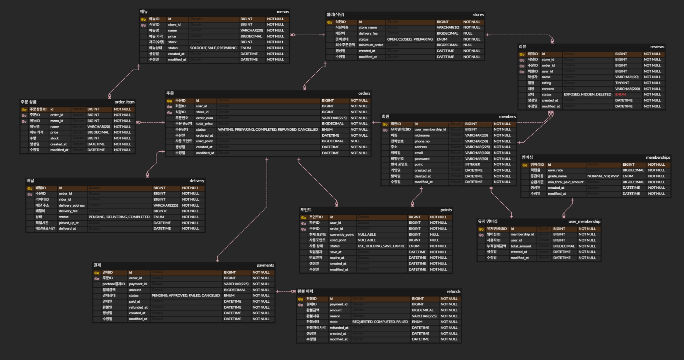
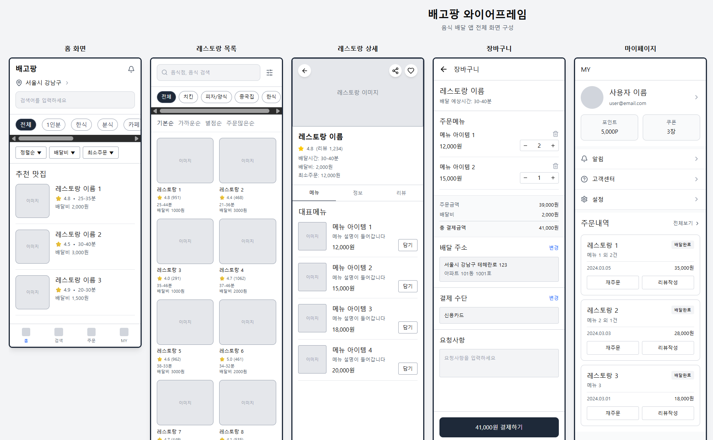

# 🍽️ HungryPang - 음식 배달 플랫폼

> Spring Boot 기반의 음식 배달 서비스 백엔드 프로젝트입니다.  
> 동시성 제어, 캐싱 전략, 결제 연동을 직접 설계하고 구현하였습니다.

<br>

## 👥 팀 구성

| 이름 | 역할 | 담당 업무 |
|------|------|----------|
| 방효경 | 팀장 | 식당, 리뷰, 메뉴 도메인 API 구현 |
| 강동혁 | 팀원 | 주문, 주문 상품, 배달 도메인 API 구현 |
| 김재진 | 팀원 | 결제, 환불, 쿠폰 도메인 API 구현 |
| 서하나 | 팀원 | 회원, 멤버십, 포인트 도메인 API 구현 |

<br>

## 📐 ERD

> 데이터베이스 엔티티 관계 다이어그램입니다.



<br>

## 🖼 와이어프레임

> 서비스 화면 설계 와이어프레임입니다.
> 


<br>

## 🛠 기술 스택

| 분류 | 기술 |
|------|------|
| Language | Java 17 |
| Framework | Spring Boot, Spring Security, Spring Data JPA |
| Database | MySQL |
| Cache | Redis (Spring Cache, RedisTemplate, StringRedisTemplate) |
| Auth | JWT (Access Token + Refresh Token) |
| Payment | PortOne (아임포트) |
| Concurrency | Pessimistic Lock, Optimistic Lock, Redis 분산 락 (AOP) |
| Build | Gradle |

<br>

## 💡 핵심 기술 및 설계 의사결정

### 1. 동시성 제어 전략 — 상황에 따른 선택

실서비스에서 발생할 수 있는 동시 요청 문제를 3가지 방식으로 나눠 해결했습니다.

#### ① Redis 분산 락 — 쿠폰 발급

쿠폰 발급은 **재고 초과 발급**이 발생하면 안 되는 대표적인 동시성 문제입니다.  
DB 락 대신 Redis 분산 락을 선택한 이유는 **빠른 응답**과 **락 범위 최소화**를 위해서입니다.

```java
@RedisLock(keyPrefix = "coupon:issue:", argIndex = 0, ttlSeconds = 3)
public CouponIssueResponse issueCoupon(Long couponId) { ... }
```

- `@RedisLock` 커스텀 어노테이션 + AOP로 락 로직과 비즈니스 로직을 분리
- Lua 스크립트로 unlock을 **원자적으로 처리**하여 다른 스레드의 토큰을 실수로 삭제하는 문제 방지

```lua
if redis.call('get', KEYS[1]) == ARGV[1] then
    return redis.call('del', KEYS[1])
else
    return 0
end
```

#### ② 비관적 락 (Pessimistic Lock) — 메뉴 재고, 포인트 차감, 리뷰 수

데이터 충돌 빈도가 높고 **정합성이 절대적으로 필요한** 영역에 적용했습니다.

```java
@Lock(LockModeType.PESSIMISTIC_WRITE)
@Query("SELECT m FROM Menu m WHERE m.id IN :ids AND m.store.id = :storeId")
List<Menu> findAllByIdInAndStoreId(@Param("ids") List<Long> ids, @Param("storeId") Long storeId);
```

- 주문 시 여러 메뉴 ID를 **정렬 후 일괄 조회**하여 데드락 방지
- 포인트 차감, 식당 리뷰 수 변경에도 동일하게 적용

#### ③ 낙관적 락 (Optimistic Lock) — 멤버십, 포인트 엔티티

충돌 빈도가 낮고 **쓰기보다 읽기가 잦은** 엔티티에는 `@Version`을 사용해 불필요한 DB 락 오버헤드를 줄였습니다.

<br>

### 2. 성능 최적화 전략

#### ① Redis 캐싱 — 조회 트래픽 감소

자주 조회되지만 변경이 드문 데이터에 캐싱을 적용하였습니다.

| 캐시명 | 대상 | TTL |
|--------|------|-----|
| `memberProfile` | 회원 프로필 | 60분 |
| `userOrderCount` | 회원별 주문 수 | 30분 |
| `store` / `stores` | 식당 단건 / 목록 | 10분 |
| `menu` / `menusByStore` | 메뉴 단건 / 목록 | 10분 |
| `storeReviews` | 식당별 리뷰 | 10분 |

수정/삭제 발생 시 `@CacheEvict`로 캐시를 즉시 무효화하여 **데이터 정합성** 유지  
회원 조회 API를 **v1 (캐시 없음) / v2 (캐시 적용)** 두 버전으로 분리하여 캐시 효과를 명확히 비교할 수 있도록 설계

#### ② 리뷰 좋아요 — Write-Behind 패턴

좋아요는 **고빈도 쓰기 요청**이 발생하는 기능입니다.  
매 요청마다 DB를 업데이트하면 병목이 발생하기 때문에 아래 방식을 채택했습니다.

```
[좋아요 요청] → Redis Hash에 delta 누적
                (review:like:delta → { reviewId: delta })
                        ↓ (1분마다 스케줄러 실행)
              [JDBC batchUpdate로 DB 일괄 반영]
                        ↓
              [Redis 초기화]
```

- 개별 DB 쓰기 → **JDBC batchUpdate**로 전환하여 N번의 쿼리를 1번으로 압축
- DB 장애 시 Redis에 데이터가 보존되어 유실 최소화

#### ③ 500만 건 성능 테스트 환경 구축

주문 목록 조회 쿼리의 성능을 검증하기 위해 JDBC Batch Insert로 500만 건의 더미 데이터를 삽입하는 테스트 API를 구현하였습니다.

```java
jdbcTemplate.batchUpdate(
    "INSERT INTO orders (...) VALUES (UUID_TO_BIN(UUID()), ?, ?, ?, ?, ?, ?)",
    batch
    );
```

<br>

### 3. 결제 시스템 설계 (PortOne 연동)

결제는 외부 서비스와 연동되는 만큼 **위변조 방지**, **멱등성**, **동시성** 세 가지를 모두 고려하여 설계하였습니다.

```
[1] 결제 준비  → 서버에서 dbPaymentId 생성, PENDING 상태로 DB 저장
[2] 클라이언트 → PortOne으로 실결제 진행
[3] 결제 검증  → PortOne API 호출하여 금액/merchant_uid 검증 → PAID 전환
[4] 웹훅 수신  → PortOne에서 비동기 호출, 멱등성 보장
```

- **비관적 락**으로 결제 검증 중 중복 요청 차단
- 웹훅은 `imp_uid` 기준 중복 체크로 **멱등성** 보장
- 결제 예외를 `retryable` 플래그로 분리 — PortOne API 장애(재시도 필요) vs 금액 불일치(재시도 불필요)
- 웹훅 기록을 `REQUIRES_NEW` 별도 트랜잭션으로 저장하여 결제 실패 시에도 **웹훅 로그 보존**

<br>

### 4. 인증/인가 설계

- JWT **Access Token (60분)** + **Refresh Token (14일)** 이중 토큰 구조
- 로그아웃 시 Access Token을 Redis 블랙리스트에 등록하여 **토큰 재사용 차단**
- Refresh Token은 Redis에 저장 후 재발급 시 교체 (Rolling 방식), DB에도 병행 저장
- `@Secured` 어노테이션으로 역할별(SELLER, RAIDER, ADMIN) 엔드포인트 접근 제어

<br>

### 5. 멤버십 자동 등급 관리

회원가입 시 등급 정책을 자동으로 초기화하고, 결제 금액 누적에 따라 등급을 자동 산정합니다.

```
NORMAL (0원~) → VIP (10만원~) → VVIP (30만원~)
```

- `DataInitializer`가 애플리케이션 시작 시 `GradeEnum` 기준으로 멤버십 정책을 자동 생성
- 주문 완료마다 누적 금액 갱신 및 등급 자동 승급 처리

<br>

## 🗂 프로젝트 구조

```
hungrypangproject
├── common
│   ├── config         # JPA Auditing, Redis, PortOne 설정, 데이터 초기화
│   ├── dto            # 공통 응답 (ApiResponse, ExceptionResponse)
│   ├── entity         # BaseEntity (createdAt, modifiedAt)
│   ├── exception      # ErrorCode Enum, ServiceException, GlobalExceptionHandler
│   ├── lock           # @RedisLock AOP 분산 락
│   └── security       # JwtFilter, JwtUtil, RedisUtil, SecurityConfig
└── domain
    ├── coupon         # 쿠폰 생성/발급 (Redis 분산 락)
    ├── delivery       # 배달 생성/완료/조회
    ├── member         # 회원가입, 로그인, 토큰 재발급, 로그아웃
    ├── membership     # 등급 자동 산정 및 승급
    ├── menu           # 메뉴 CRUD, 재고 관리
    ├── order          # 주문 생성/취소/상태 관리
    ├── payment        # 결제 준비/검증/웹훅 (PortOne)
    ├── point          # 포인트 적립/사용/확정
    ├── review         # 리뷰 CRUD, 좋아요 (Redis Write-Behind)
    └── store          # 식당 CRUD, 검색
```

<br>

## 📋 주요 API

### 인증 (`/api`)
| Method | URL | 설명 |
|--------|-----|------|
| POST | `/signup` | 회원가입 |
| POST | `/login` | 로그인 (AccessToken + RefreshToken 발급) |
| GET | `/refresh` | 토큰 재발급 |
| POST | `/logout` | 로그아웃 (블랙리스트 등록) |

### 주문 (`/api/orders`)
| Method | URL | 설명 |
|--------|-----|------|
| POST | `/` | 주문 생성 (재고 차감, 포인트 사용, 멤버십 갱신) |
| PATCH | `/{orderId}/cancel` | 주문 취소 |
| PATCH | `/{orderId}/status` | 주문 상태 변경 |
| GET | `/count` | 주문 수 조회 (캐싱) |

### 결제 (`/api/payments`)
| Method | URL | 설명 |
|--------|-----|------|
| POST | `/prepare` | 결제 준비 |
| POST | `/verify` | 결제 검증 |
| POST | `/webhook` | PortOne 웹훅 수신 |

### 그 외
| Method | URL | 설명 |
|--------|-----|------|
| POST | `/api/coupons/{couponId}/issue` | 쿠폰 발급 (분산 락) |
| POST | `/api/orders/{orderId}/reviews` | 리뷰 작성 |
| POST | `/api/reviews/{reviewId}/like` | 리뷰 좋아요 (Redis) |
| POST | `/api/deliverys` | 배달 요청 (라이더 자동 배정) |

<br>

## ⚙️ 실행 방법

### 사전 요구사항
- Java 17, MySQL, Redis

### 환경 변수 설정

```yaml
jwt:
  secret:
    key: {Base64 인코딩된 시크릿 키}

portone:
  api:
    key: {PortOne API Key}
    secret: {PortOne API Secret}

spring:
  datasource:
    url: jdbc:mysql://localhost:3306/{DB명}
    username: {유저명}
    password: {비밀번호}
  redis:
    host: localhost
    port: 6379
```

### 빌드 및 실행

```bash
./gradlew build
java -jar build/libs/hungrypangproject-*.jar
```

<br>

## 📌 공통 응답 형식

```json
// 성공
{ "success": true, "code": 200, "data": { ... } }

// 실패
{
  "success": false,
  "code": 400,
  "data": {
    "errorCode": 400,
    "message": "최소 주문금액을 충족하지 않습니다.",
    "path": "/api/orders",
    "time": "2025-03-23T10:00:00"
  }
}
```
